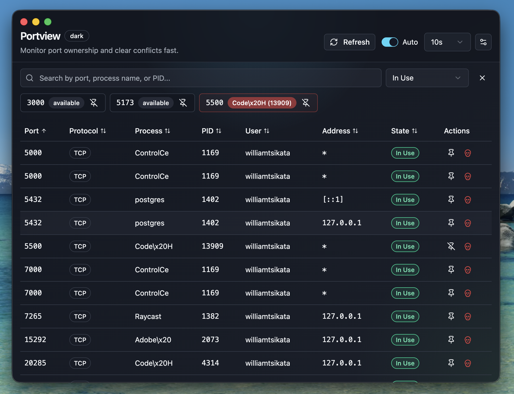

# Portview

A desktop app for developers to see which processes are using local ports and kill them — without touching the terminal.



## Features

- Live port scanning (macOS via `lsof`, Windows via `netstat`)
- Kill and force-kill processes by port
- Search and filter by port number, process name, PID, or state
- Safety badges showing whether a process is safe to kill (System, Background, App, Dev)
- Pinned ports for your most-used dev servers (3000, 5173, 8080, …)
- Auto-refresh at a configurable interval
- In-app update checks for packaged releases
- Menu bar / system tray for quick access without opening the full window
- Window size and position persistence

## Download

Grab the latest installer from the [Releases page](https://github.com/tsikatawill/portview/releases):

- **macOS** — download the `.dmg` file (e.g. `Portview-<version>-universal.dmg`)
- **Windows** — download the `.exe` installer (e.g. `Portview-Setup-<version>.exe`)

### macOS: Bypassing Gatekeeper

Portview is not signed with an Apple Developer certificate, so macOS will block it on first launch. To open it:

1. Open the `.dmg` and drag **Portview.app** into your Applications folder.
2. Try to open the app — you'll see a warning saying it can't be opened.
3. Go to **System Settings → Privacy & Security**.
4. Scroll to the **Security** section — you'll see _"Portview.app" was blocked to protect your Mac_.
5. Click **Open Anyway**, then confirm in the dialog that follows.

The app will launch normally from then on.

Alternatively, remove the quarantine flag from the terminal:

```sh
xattr -cr /Applications/Portview.app
```

### Windows: Bypassing SmartScreen

On first launch, Windows may show a SmartScreen warning. Click **More info**, then **Run anyway**.

## Building from source

**Prerequisites:** Node.js ≥ 20, npm

```bash
git clone https://github.com/tsikatawill/portview.git
cd portview
npm install
npm run dev          # start in dev mode
npm run build        # compile
npm run dist         # package installers (output: dist/)
```

## Auto-updates

Portview can check GitHub Releases for updates from inside the app.

- The Settings page includes a `Check now` button
- The tray menu includes `Check for Updates`
- Downloaded updates can be installed with a restart prompt

### Release requirements

- Auto-updates only work in packaged builds, not `npm run dev`
- macOS auto-updates require a signed app
- Release tags must match `package.json` version, for example `v1.0.2`
- GitHub Releases must include the generated installer plus update metadata files such as `latest.yml` or `latest-mac.yml`

## Running tests

```bash
npm test             # run all tests once
npm run test:watch   # watch mode
```

## Contributing

See [CONTRIBUTING.md](CONTRIBUTING.md).

## License

[ISC](LICENSE) © William M. Tsikata
